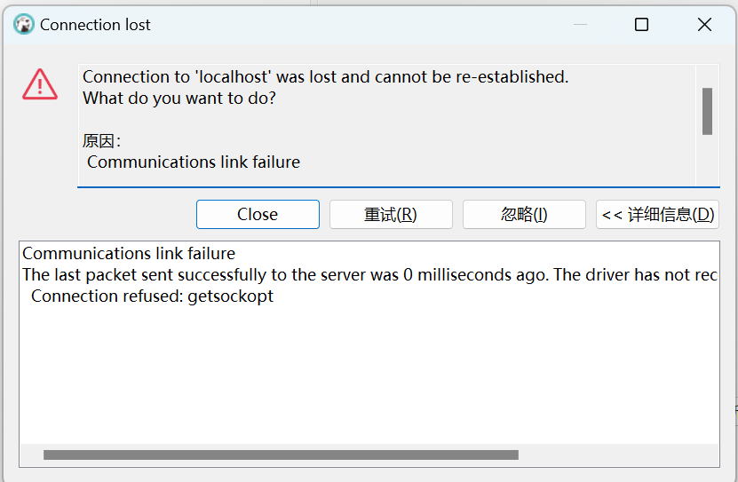
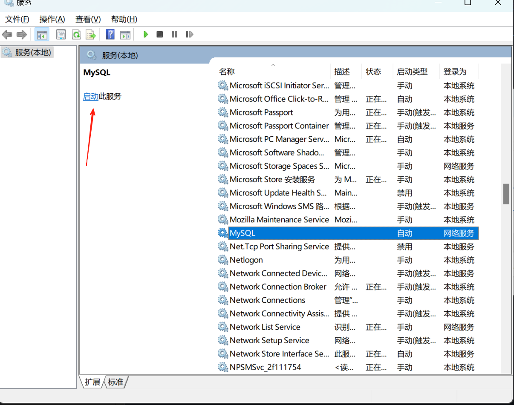
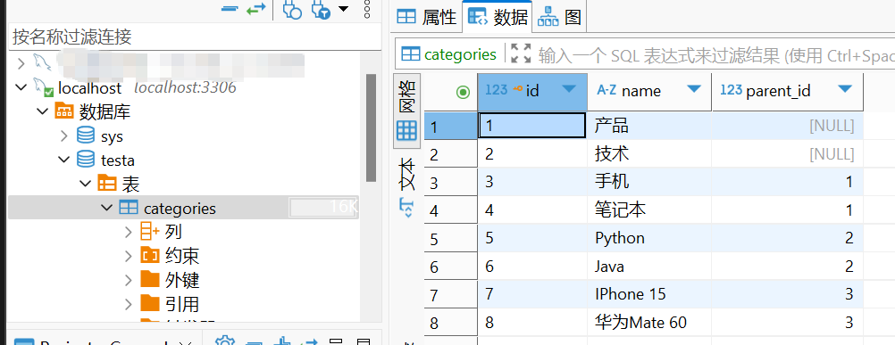
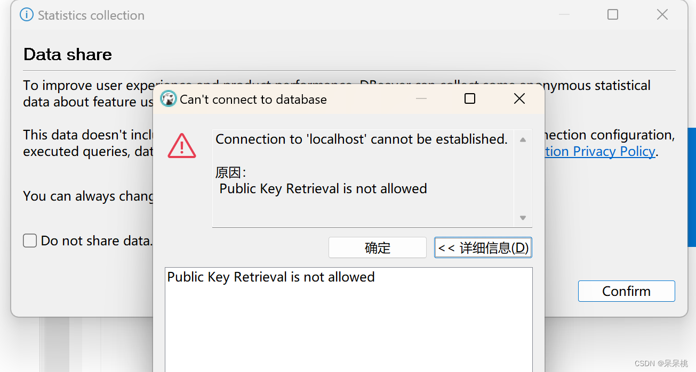
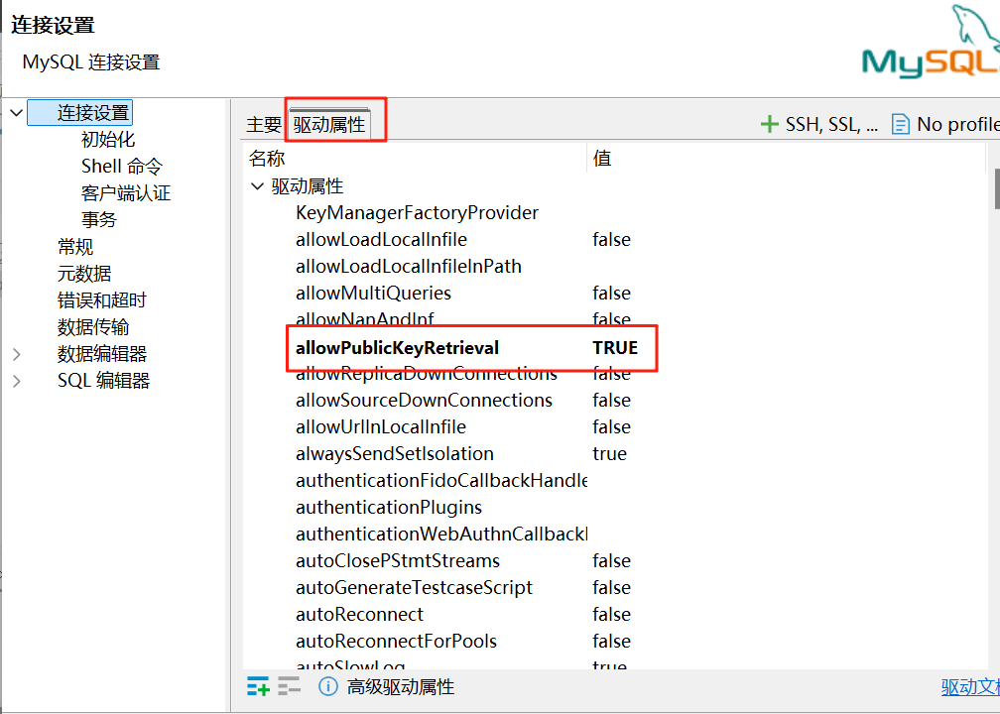

# MySQL常见问题解决

## 1.  Communications link failure

使用DBeaver连接MySQL数据库，首先需要安装DBeaver和MySQL数据库。

>下载并安装DBeaver：https://dbeaver.io/download/ 安装配置可看教程

>安装MySQL数据库：https://dev.mysql.com/downloads/mysql/ 安装配置可看教程

DBeaver连接MySQL数据库前，需要**启动MySQL服务**。否则在创建数据库后电脑重启重新用DBeaver连接数据库时会提示连接失败，具体报错如下：

>有时候可能是`Connection refused: getsockopt，Communications link failure The last packet sent successfully to the server was 0 milliseconds ago. The driver has not received any packets from the server.Communications link failure`这样的提示，解决方法相同。

为了解决上述问题，需要先启动MySQL服务，具体步骤如下：

1. 使用win+R打开运行框，输入services.msc，打开服务管理器。

2. 找到MySQL服务，右键点击，选择启动。

3. 等待服务启动完成,重新启动DBeaver连接数据库，如下所示连接成功。

## 2. Public Key Retrieval is not allowed
按照上述重新启动DBeaver后，可能出现以下问题：

这是 MySQL 8.0 及以上版本常见的安全连接问题，问题原因主要分为MySQL 8.0+ 默认使用 caching_sha2_password 认证插件、DBeaver 驱动默认禁用公钥检索（安全限制）和户端与服务器间的 SSL/TLS 配置不匹配等。

**解决方法**：右键localhost，选择`编辑 连接`，点击`驱动属性`，将`allowPublicKeyRetrieval`设置为`true`，即可。

