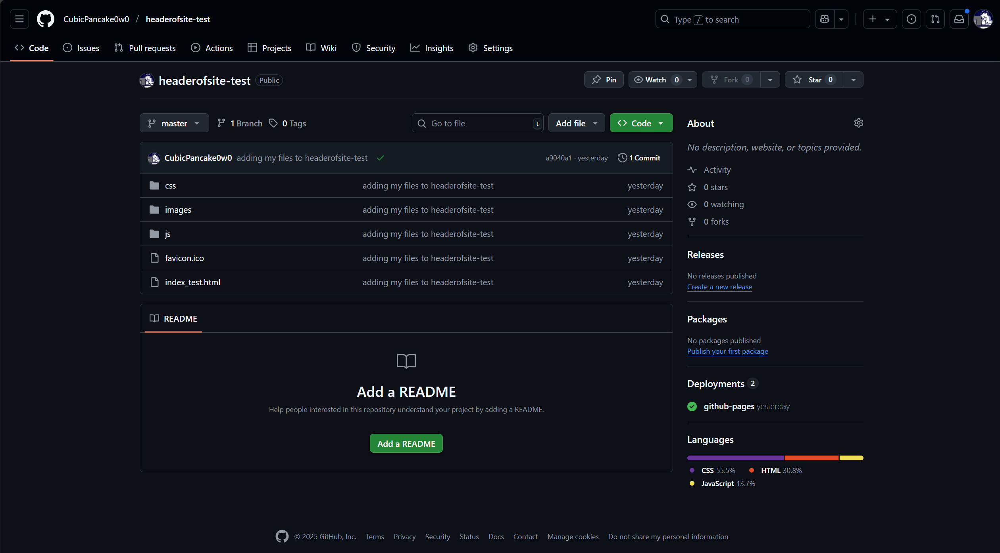

# Git快速上手教程
----


## 什么是Git？

Git是一个开源的分布式版本控制系统，用于敏捷高效地处理任何或小或大的项目。Git与常用的版本控制工具CVS、Subversion等不同，它是一个功能完整的分布式版本控制系统，不但**能记录每次更新，还能记录每次提交，从而可以随时回到每一次的版本**。

Git的工作区域主要包括**工作目录（Working Directory）、暂存区（Staging Area）和本地仓库（Local Repository）**。开发者在工作目录中进行代码编写和修改，然后将修改添加到暂存区，最后将暂存区的内容提交到本地仓库。这种三阶段的工作流程使得Git能够精确地控制每次提交的内容，提高版本管理的灵活性。

## Git有什么用？

当我们开发软件的时候，会创建很多源代码文件，这些源代码文件一般会放在一个目录里面，这个就是我们的code base，对这些源代码文件，我们每天都在迭代开发，因此需要对其进行管理，这样我们就能知道这些源代码文件的历史，比如前天改了什么，今天又改了什么。一个人自己写代码对软件开发管理感觉还不深，如果是多个人一起开发一个项目，这个时候怎么保证每个人的修改别人可以获取到而又不影响到其他人的代码，这就需要软件版本管理工具或者软件，Git就是这样一款软件。

----
## Git的安装和基础配置

在安装配置好Git后 ，就可以开始创建使用Git仓库实施版本控制了。

## 创建并使用Git仓库(Repository)

一般来讲，大家获取到一个目录下的代码源文件后通常是不包含任何版本控制的功能，即只是一个纯粹的源代码文件集，即code base。当修改其中的代码后，没法记录下来修改历史，并不方便我们后面的修改溯源，返回上一个修改版本等操作，因此，我们需要用到Git来完成版本控制的功能。

>为了让后面讲解更直观，这里基于一个静态网页工程(headertest)为例说明。目录位置放置在：`f:\BTZHprojs\BTZH_headertest`下（**实际使用时，注意修改为自己文件所在位置**）

### 创建Git仓库主要步骤

1. 首先，按住win+R，输入cmd，打开命令行窗口，输入以下命令进入该工程所在的位置：
```BASH
   cd f:\BTZHprojs\BTZH_headertest
```
2. 然后，输入以下命令，该命令告诉 git 工具将该目录转换为 git 仓库：
```BASH
   git init
```
3. 接着，输入以下命令，该命令将当前**目录下所有文件**添加到**暂存区**：
```BASH
   git add .
```
4. 最后，输入以下命令，该命令**将暂存区中的文件**提交到**本地仓库**：
```BASH
   git commit -m "first commit"
```
>其中，使用git commit -m “提交信息”可以为本次提交添加描述性的信息，方便日后查阅。

**至此，我们已经创建并使用了Git仓库。**

上面三条命令成功执行后，我们的Git仓库就创建成功了。Git仓库在物理上就是下面的.git目录：


>后续可点进入看看里面的内容，目录下含有HEAD，index，refs，head，tag，object，commit，pack等，这些都是Git非常重要的术语，我们后面会对其进行一一阐述。

----

### 修改代码后的版本更新

1. 当我们修改了代码后，可以在CMD中输入以下命令,**查看Git的最新状态**：
```BASH
   git status
```

例如，我在`/js/header_toggle.js`文件中添加了更多的注释，此时再次输入命令可以看到：


>上述日记提示你：header_toggle.js文件已修改（注意：日志中还出现了not staged for commit字样，以及git add字样，后面解释他们的意思）

2. 输入以下命令，查看更具体的修改内容：
```BASH
   git diff
```


>上图中，红色带-号表示被删除/被修改的行，绿色带+号表示新增的行/被修改的结果。

3. 接下来需要把相应的修改后的代码**首先提交到缓冲区**(stage/index)，即用如下代码：
```BASH
   git add .
```

>这就是查看修改状态的日记提示中提到的命令。我们使用该指令将所有修改都添加到stage（**.表示所有修改，所有修改不仅指所有的修改文件，又指所有新添加的文件和删除的文件**）

4. 然后，再次输入命令，提交到本地仓库：
```BASH
   git commit -m "add more comments"
```

>其中，-m后面是提交信息，可以自己添加描述性的文字。并且注意一定是双引号，单引号 ' 在 Windows cmd 中无效。

5. 最后，输入命令，查看当前仓库的版本历史：
```BASH
   git log
```


>上图中，依次显示了版本号，作者，日期，修改位置等信息。

6.此时，再次查看目前git状态：
```BASH
   git status
```

**至此，我们已经使用Git仓库完成了版本控制的功能。**

----

### 用git上传项目到GitHub：远程仓库(Remote Repository)

当我们完成了版本控制功能后，我们需要将本地仓库上传到远程服务器，这样其他人就可以通过远程仓库获取到我们修改后的代码。GitHub是基于git实现的代码托管，**利用GitHub，你可以将项目存档**，与其他人分享交流，并让其他开发者帮助你一起完成这个项目。优点在于，他支持多人共同完成一个项目，因此你们可以在同一页面对话交流。
>关于如何注册使用GitHub，请自行搜索相关教程，可使用Watt Toolkit进行网络加速（原名Steam++）。

>下面的教程不涉及SSH key的配置和使用。具体使用SSH key上传的方法见后。

>下面教程涉及的所有cmd命令需要在本地仓库目录下执行，即在`f:\BTZHprojs\BTZH_headertest`目录下执行。

1. 首先，需要注册登录GitHub账号，并创建一个仓库（Repository）:

进入到如下页面，其中仅Repository name为必填项，其他项可根据需要修改：


>此处，我设置的Respository name为"headerofsite_test"，其他项默认即可。

至此，仓库创建成功，随后页面显示：


2. 在当前页面上，你可能对`…or push an existing repository from the command line`（或从命令行推送现有仓库）这部分感兴趣。你应该看到本节中列出的两行代码。**复制整个第一行，将其粘贴到命令行中，然后按回车键**。命令应该看起来像是这样的：
```BASH
   git remote add origin https://github.com/CubicPancake0w0/headerofsite_test.git
```
>注意，此命令（还有后续命令）需要在本地仓库目录下执行，即在f:\BTZHprojs\BTZH_headertest目录下执行。
>如果找不到后面的链接地址，可在仓库主页找到`Code -> HTTPS`链接，复制链接地址，然后将其粘贴到命令行中。


3. 接下来，键入以下两个命令，每个命令之后按回车。这些命令是将代码上传到仓库，并要求 Git 管理这些文件的准备工作。
```BASH
    git add --all
    git commit -m 'adding my files to my repository'
```

1. 最后，将代码推送到 GitHub，通过你正在访问的 GitHub 网页，然后输入我们在“…or push an existing repository from the command line”（或从命令行推送现有仓库）部分看到的两个命令中的第二个命令：
```BASH
   git push -u origin master
```
**到此，本地代码已经推送到github仓库了**，我们现在去github仓库看看。

如图，上传成功。

----

### 如何撤销目录下的 Git 

如果在使用`git init`命令初始化仓库后，发现目录下已经有了.git文件，或者在其他地方克隆了仓库，那么我们需要将原有的仓库删除，重新初始化一个仓库。

>注意：删除仓库后，之前的提交记录也会被删除，不可恢复。

下面是具体步骤：
1. 在`桌面`上右键点开`显示更多选项`，选择`Open Git Bash here.`，打开Git Bash命令行。
2. 通过`cd`命令切换到.git仓库所在目录，输入命令**查看当前目录中是否存在.git**：
```BASH
   $ ls -a
```
3. 如果存在.git文件，则输入命令**删除.git文件**：
```BASH
   $ rm -rf .git
```
>或者在Windows系统中使用以下命令：
```BASH
   rmdir /S .git
```


这样，我们就成功地撤销了 git init 命令并删除了 Git 仓库。


### 其他常用功能

#### 分支(branch)管理

1. 查看与创建分支：


在我们成功执行"git commit"后，cmd会有回显信息，里面会提到"master"，我们可以先在CMD中输入如下命令：
```BASH
   git branch
```
可以看到当前仓库的分支情况，默认情况下，Git仓库只有一个分支master，即我们刚才创建的分支：


>"git branch"返回"master"，告诉你目前仓库只有一个master树枝，即主干(trunk)，这个就是Git仓库初始化后的状态：只有一个主分支，这个主分支默认名字是master。

可以使用以下命令修改主分支的默认名字，比如改成main：
```BASH
   git branch --global init.defaultBranch main
```

>GitHub创建Git仓库，默认分支名就是main。


#### Github Pages

GitHub Pages是一个静态网站托管服务，它可以帮助你快速搭建个人博客、项目官网等静态网页。其主要特点包括：
1. 免费托管
2. 使用简单：用户只需在自己的 GitHub 帐户中创建一个特定名称的仓库，将网站文件上传到该仓库即可
3. 自定义域名：用户可以选择使用自定义域名来访问他们的 GitHub Pages 网站，这使得它们更适合个人网站、博客和项目页面；
4. 支持多种静态网站生成工具：GitHub Pages 支持多种静态网站生成工具，如 Jekyll、Hugo、Gatsby 等，以及纯HTML、CSS 和 JavaScript 等前端技术，这使得用户能够根据自己的需求选择适合他们的工具； 
5. 自动构建：GitHub Pages 可以自动构建用户上传的网站内容，无需用户手动生成或编译网页，这使得发布网站变得更加简单。


**Github 站点类型**

GitHub Pages 支持两种站点类型，具体可以根据实际需要进行选择创建：
- **个人或组织站点 User/Organization Pages**：对于个人或组织站点，**每个GitHub用户或组织只能有一个这样的站点**，它通常使用`username.github.io`或`organizationname.github.io`的格式，这是GitHub Pages的默认站点，通常用于个人网站、博客等。
- **项目站点Project sites**：对于项目站点，每个GitHub仓库可以有一个关联的GitHub Pages站点，这意味着**对于每个项目，您可以创建一个独立的GitHub Pages站点，无限制**。

考虑到本教程中的项目本身就是web相关，因此下面只介绍项目站点的搭建。现在首先从头开始说起：
1. 首先同样是在Github中创建一个仓库，随后点击创建一个新文件。


2. 输入文件名为`index.html`，文件内容可按照html语言进行编辑，随后点击`Commit changes`按钮。


3. 编辑本次提交的基本信息，随后点击Commit Changes按钮。


4. 点击`Settings`按钮，进入仓库设置页面。找到`Pages`选项卡，选择`Branch`为`main`下`/(root)`，然后点击`Save`按钮。


>这一步的`Branch`也可能不是`main`，有可能是`master`等等其他，具体情况可看`git branch`命令的返回结果。

1. 保存后**不断刷新**保存之后的页面，直至出现GtihubPages的地址：


6. 在上面的页面中，点击Visit site按钮，即可打开网站。


至此，Github Pages项目站点搭建完成。

>注意：
>- 如果是对于一个已经打包好的完整web项目（除了index.html之外，还有css，js等其他文件），可以直接将项目文件上传到Github仓库，然后从上述步骤4.进行站点的部署。
>- 如果进入的时候显示404NOTFOUND之类的页面，可能是域名没有具体地指向主页Html文件，可以检查链接地址是否完整
，尝试在最后添加例如`index.html`等文件名。

